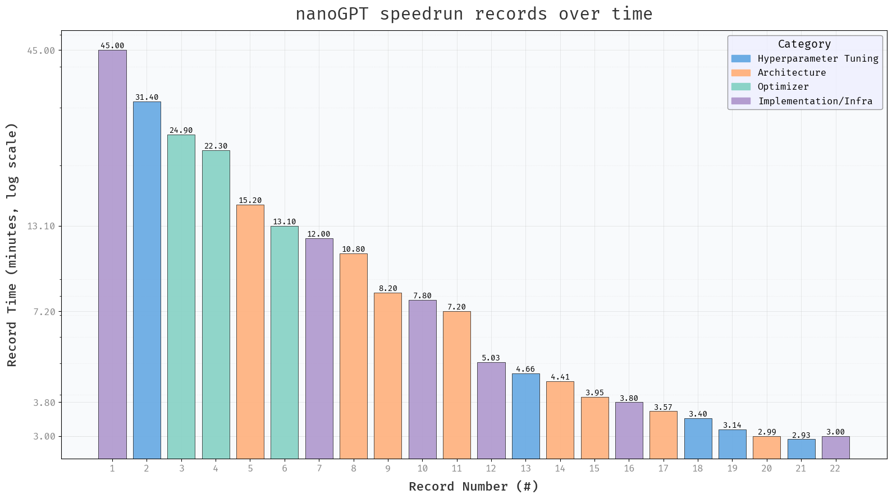
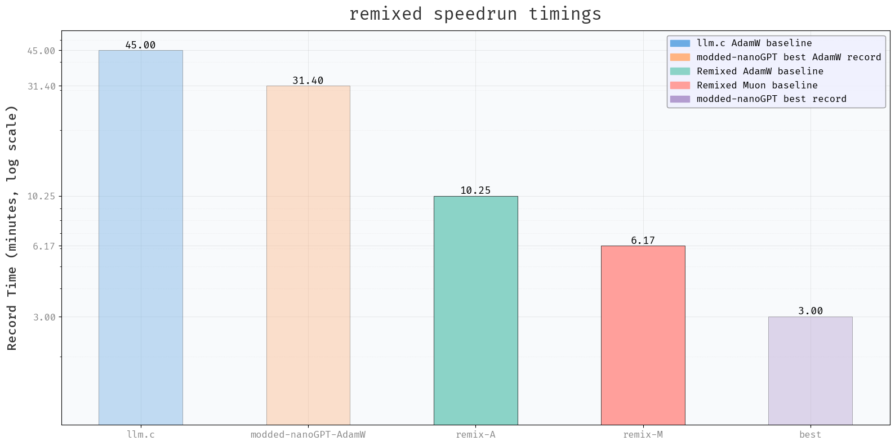

# modded-nanoGPT-remixed

*Re-arranging the ingredients in nanoGPT speedrun for stronger vanilla baselines & more insights*




[modded-nanoGPT](https://github.com/KellerJordan/modded-nanogpt) records the sequential improvements to a *speedrun* on nanoGPT, i.e. the goal is: achieve a cross-entropy loss of 3.28 on the first 10,485,760 tokens of the FineWeb validation set in the minimum amount of time possible on an 8xH100 machine.
The progress since an initial 45 min training time is amazing, but the current record of 3 minutes is achieved through many types of improvements, from upgrading PyTorch to network architecture/optimizer changes and hyperparameter tuning.
The plot above demonstrates that **it is hard to disentangle the effects of these changes**.

Consider the following simple questions that are difficult to answer, given the repo's current form tailored towards speedrunning:
- **How fast does a modern dense transformer arch + AdamW baseline train?** The best AdamW time recorded in modded-nanoGPT is ~31 mins. Clearly we can do better with a more up to date architecture/tuning, while still using AdamW. But how much?
- **What's the pure improvement from Muon over the AdamW baseline?** If we only (but [see this](#optarch-interactions)) change the optimizer to tuned Muon, what's the new time for training a dense baseline transformer?

By answering these questions,
- we can get a better idea of what good current baselines are.
- there's less reason to ignore these baselines since they use standard established architectures.
- we can cleanly test new ideas that might be orthogonal or incompatible with other tricks, compare AdamW and Muon to other optimizers with a better baseline architecture, or study the interaction of architecture changes on AdamW vs Muon optimization.

The ingredients to get these answers can be extracted from the rich git history of modded-nanoGPT: we just need to dig through it, categorize and re-order changes, and *remix* it.
So that's what this repo does.

## Summary of Results



| Model | Description                          | Training Time | Script           | Log         |
|-------|--------------------------------------|---------------|------------------|-------------|
| A     | Tuned baseline transformer with Adam | 10 m 15 s     | `train_gpt_A.py` | ./log/A.txt |
| M     | Tuned baseline transformer with Muon | 6 m 7 s       | `train_gpt_M.py` | ./log/M.txt |

Now we know that **we can train a modern 12-layer dense attention transformer baseline to 3.28 FineWeb val loss in about 10 mins on 8xH100 with AdamW, and in about 6 mins with Muon** with a pretty standard setup.

Contributions that can improve these baselines (through hyperparameter tuning) or suggestions for additional ones are very welcome!

## Details

These baselines train/evaluate at a fixed max-context length while respecting document boundaries. 
This changed during the evolution of the [modded-nanoGPT](https://github.com/KellerJordan/modded-nanogpt) speedrun, making it tricky to compare numbers across all records.

What is a *modern transformer* baseline? Compared to the older llm.c baseline, these baselines use (what I think should be) standard ingredients for a baseline transformer in 2024/2025:
- (truncated) RoPE
- squared ReLU activation
- RMS norm for queries, keys, inputs embeddings
- document masking through flex-attention
- tuned hyperparameters for RoPE, learning rate schedule etc

The baselines don't use ingredients in the best modded-nanogpt speedrun of 3 mins that are either exotic (not commonly used yet) or are more likely to impact different datasets/applications differently, such as:
- Value Embedding skip connections
- Selectively removing layers
- Selective use of Sliding window attention
- Attention window warmup
- FP8 computation

These can be added to obtain modified baselines for various purposes.

### Opt/Arch interactions

Although we often like to see "pure ablations" where only component (either a specific model component or data or optimizer) changes, in practice such ablations don't tell the full story, because there can be interactions between different components of the full setup.
In the current baselines here, the Adam baseline (A) uses tied embedding/output weights, while the Muon baseline (M) uses logit soft-capping. It seemed difficult to quickly tune away these differences with the compute I have currently, and contributions towards this are welcome.

## License and Citation

This code is derived from [modded-nanoGPT](https://github.com/KellerJordan/modded-nanogpt).
Both the original and the changes here are MIT-licensed.

If you use these baselines/code, you should cite modded-nanoGPT:

```bibtex
@misc{modded_nanogpt_2024,
  author       = {Keller Jordan and Jeremy Bernstein and Brendan Rappazzo and
                  @fernbear.bsky.social and Boza Vlado and You Jiacheng and
                  Franz Cesista and Braden Koszarsky and @Grad62304977},
  title        = {modded-nanogpt: Speedrunning the NanoGPT baseline},
  year         = {2024},
  url          = {https://github.com/KellerJordan/modded-nanogpt}
}
```

Please additionally cite this repo as follows:

```bibtex
@misc{modded_nanogpt_remix,
  author       = {Rupesh K Srivastava},
  title        = {modded-nanogpt-remixed},
  year         = {2025},
  url          = {https://github.com/flukeskywalker/modded-nanogpt-remixed}
}
```
